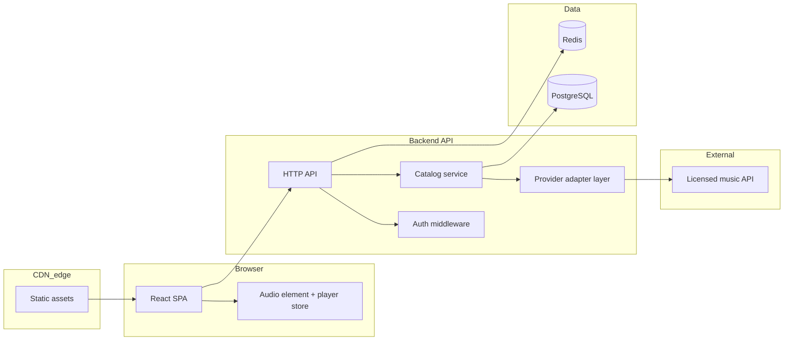

# Spotify-like music streaming web app — technical plan

## Context and constraint (practical)

Building something *visually and technically* like Spotify is feasible for learning; reproducing Spotify’s **catalog and legal streaming** is not. Plan around **royalty-free APIs**, **self-hosted demo audio**, or **developer-preview** sources (e.g. [Jamendo](https://developer.jamendo.com/v3.0), community datasets with clear terms), and treat “tracks” as normalized `Track` entities your backend owns metadata for. The architecture below stays valid regardless of which legal source you pick.

**Phase 1:** Data comes from a **self-hosted** [jiosaavn-api](https://github.com/sumitkolhe/jiosaavn-api) instance (local Docker or your deploy). Next.js **Route Handlers** proxy that service; the **browser never calls** the JioSaavn host or sees raw upstream JSON. This is unofficial third-party software — respect JioSaavn’s terms and use for personal learning only.

---

## Phase 1 (simplified): Next.js App Router + API-route proxy + real Saavn data

**Goal:** Album list → album detail → play tracks with a **persistent** player bar. **No Express/Fastify** — only Next.js Route Handlers.

**Stack:** Next.js (App Router) + TypeScript. **Styling:** Tailwind or CSS Modules. **Player state:** `zustand` (unchanged). **Motion:** optional on cards.

### Upstream API (reference)

The Kolhe API mounts routes under `**/api`** on its own origin, e.g. `GET {JIOSAAVN_API_BASE_URL}/api/albums?id=…` returns one album with songs; there is **no** dedicated “browse all albums” endpoint. For your `**GET /api/albums`** list, proxy `**GET …/api/search/albums?query=…&limit=…`** and map results into your `Album` DTOs (`songs: []` on the list to keep payloads small). `**GET /api/albums/[id]`** proxies `**GET …/api/albums?id=[id]`** and maps full songs + `audioUrl`. Confirm paths against [saavn.dev docs](https://saavn.dev/docs) if the project version differs.

### Public DTO contract (what the browser sees)

Only Route Handlers return JSON; shape is stable and **does not** mirror upstream field names.

**Track**

```ts
{ id: string; name: string; duration: number; audioUrl: string }
```

**Album**

```ts
{ id: string; name: string; artist: string; image: string; songs: Track[] }
```

**Mapping notes (implement in server-only helpers):**

- `**image`:** pick a single HTTPS URL (e.g. highest-res from upstream `image` / `downloadUrl` arrays if present).
- `**artist`:** join primary artists textually (upstream exposes structured `artists` — flatten to one string).
- `**duration`:** seconds as **number** (`null` upstream → `0` or omit track if unplayable).
- `**audioUrl`:** pick one entry from song `downloadUrl` (e.g. prefer 320kbps / last link per docs — document choice in code). If no URL, exclude song or skip with logging; player should not receive empty `src`.

### Environment (server-only)

- `JIOSAAVN_API_BASE_URL` — base URL of **your** jiosaavn-api deployment, **no** trailing slash (e.g. `http://localhost:3001`).
- `JIOSAAVN_ALBUMS_SEARCH_QUERY` (optional) — default search term for the home album grid (e.g. `bollywood` or `2024`); overridable later via query param if you want, but keep Phase 1 minimal (fixed env is enough).

Never prefix these with `NEXT_PUBLIC_` — they must not ship to the client bundle.

### Exact folder structure (App Router)

```text
project-root/
  src/
    app/
      api/
        albums/
          route.ts              # GET list -> proxy search/albums + map to Album[]
        albums/[id]/
          route.ts              # GET detail -> proxy albums?id= + map full Album
      layout.tsx
      page.tsx                  # home: album browse (loads via musicService)
      globals.css
      album/[albumId]/page.tsx
    components/
      layout/                   # AppShell, Sidebar — unchanged
      browse/                   # AlbumGrid, AlbumCard
      album/                    # AlbumHero, AlbumActions, TrackList, TrackRow
      player/                   # PlayerBar, controls, SeekBar, etc.
    lib/
      types/
        music.ts                # Album + Track DTO types (imported by client + server)
      formatDuration.ts
      server/                   # server-only imports (jiosaavn fetch + mappers)
        saavnHttp.ts            # fetchUpstream(path, init), base URL, timeouts
        mapAlbum.ts             # upstream single-album response -> App Album
        mapAlbumSearchItem.ts   # search result row -> App Album (songs: [])
    services/
      musicService.ts           # client: fetch('/api/albums'), fetch(`/api/albums/${id}`)
    stores/
      playerStore.ts            # unchanged API; still consumes App Track/Album
    hooks/
      useAudioEngine.ts
```

Remove `**lib/catalog.ts**` entirely. Optional: add `import 'server-only'` at top of `lib/server/*` to block accidental client imports.

### Backend: Route Handlers


| Route                  | Behavior                                                                                                                                                                                                                    |
| ---------------------- | --------------------------------------------------------------------------------------------------------------------------------------------------------------------------------------------------------------------------- |
| `GET /api/albums`      | Call upstream `GET /api/search/albums` with `query` from env (optional `limit`). Map each hit to `{ id, name, artist, image, songs: [] }`. On upstream failure return `502` + generic message; **do not** forward raw body. |
| `GET /api/albums/[id]` | Call upstream `GET /api/albums?id=[id]`. Map to full `Album` with `songs` populated. `404` if not found.                                                                                                                    |


**Clean architecture:** Route Handlers may call small functions in `lib/server/`; **no** DB or extra frameworks in Phase 1.

### Frontend: `services/musicService.ts`

- `**getAlbums()`:** `fetch('/api/albums', { cache: 'no-store' })` (or `next: { revalidate: 0 }`); parse JSON to `Album[]`.
- `**getAlbumById(id)`:** `fetch('/api/albums/' + id, { cache: 'no-store' })` (or template literal); parse to `Album`; throw **or** return `null` on `404` — pick one and handle in UI (`notFound()` on album page).

Use **relative URLs** so the same code works locally and on Vercel. Components **must not** import `lib/server/*` or reference `JIOSAAVN_API_BASE_URL`.

### Exact components to build

Same component set as before; only **data source** changes:


| Component                                               | Responsibility                                                                          |
| ------------------------------------------------------- | --------------------------------------------------------------------------------------- |
| `AppShell`                                              | Layout + bottom player slot                                                             |
| `Sidebar`                                               | Home link                                                                               |
| `AlbumGrid`                                             | Renders `AlbumCard[]` from **props** (parent loads via `musicService`)                  |
| `AlbumCard`                                             | Cover, title, artist, link to `/album/[id]`                                             |
| `AlbumHero` / `AlbumActions` / `TrackList` / `TrackRow` | Same as before; album detail page loads **one** `Album` via `musicService.getAlbumById` |
| `PlayerBar` + `useAudioEngine`                          | Unchanged; `audioUrl` on each `Track` comes from API                                    |


**Loading/error UX (minimal):** skeleton or “Loading…” on home/detail; simple error message if proxy fails.

### `playerStore` (unchanged)

- Still `**queue: Track[]`**, `**currentIndex`**, `**isPlaying**`, `**volume**`, `**playAlbum` / `playTrack**`, etc.
- Types imported from `lib/types/music.ts` — same DTOs the API returns.

### Step-by-step implementation plan (Phase 1)

1. **Run jiosaavn-api** locally (Docker or Bun/Node per its README) and confirm `GET /api/albums?id=…` works.
2. **Scaffold** Next.js (App Router, TS), add `zustand`, add `.env.local` with `JIOSAAVN_API_BASE_URL` (+ optional search query).
3. **Types:** add `lib/types/music.ts` with `Album` and `Track` matching the contract above.
4. **Server mappers:** implement `lib/server/saavnHttp.ts` and mapping functions; test mappings with one real upstream response in a unit test or temporary `console.log` (remove before commit if you prefer).
5. **Routes:** implement `app/api/albums/route.ts` and `app/api/albums/[id]/route.ts`; return only mapped JSON; map HTTP errors cleanly.
6. `**musicService.ts`:** implement `getAlbums` / `getAlbumById` calling **only** `/api/…`.
7. **UI shell:** `AppShell`, `Sidebar`, dark `globals.css`, root `layout` + `useAudioEngine` + hidden `<audio>`.
8. **Home:** client wrapper (or client page) that calls `musicService.getAlbums()` then renders `AlbumGrid`.
9. **Album page:** load album by id via `musicService`; on missing album call `notFound()`; render hero + track list; wire play actions to `**playerStore`** (same as before).
10. **QA:** playback across navigation; verify Network tab shows **only** same-origin `/api` + stream host from `audioUrl` (expected for actual audio files); confirm no env leakage in client bundle (`next build` + inspect or use `@next/bundle-analyzer` later optional).

### Phase 1 scope guardrails

- **In scope:** album list, album detail, playback, proxy layer, DTO mapping, `musicService`.
- **Out of scope:** separate Express app, TanStack Query, Redis, auth, search UI (even though upstream supports search — add in Phase 3).

---

## 1. Tech stack justification


| Layer                         | Choice                                                                                             | Why (learning + real-world)                                                                                                                                                                               |
| ----------------------------- | -------------------------------------------------------------------------------------------------- | --------------------------------------------------------------------------------------------------------------------------------------------------------------------------------------------------------- |
| **Frontend**                  | **React 18+ + TypeScript + Vite**                                                                  | Dominant hiring/debugging surface, fast HMR, easy code-splitting. TS catches API contract drift early.                                                                                                    |
| **Routing / data fetching**   | **React Router** + **TanStack Query**                                                              | Server/async state (lists, search, playlists) separate from UI/player state; caching, retries, stale-while-revalidate match production apps.                                                              |
| **Client state (player)**     | **Zustand** (small store) *or* **Jotai** (atoms)                                                   | Player state is cross-route; avoid prop drilling. Lighter than Redux for MVP; still easy to log/reason about. **Optional later:** Redux Toolkit if you explicitly want enterprise patterns.               |
| **Styling / motion**          | **CSS Modules** or **Tailwind** + **Framer Motion**                                                | Spotify feel = motion + layout more than a specific CSS framework. Framer Motion gives layout transitions without fighting a design system on day one.                                                    |
| **Backend**                   | **Node.js + TypeScript** with **Fastify** (MVP) → **NestJS** *optional migration*                  | Fastify: fast, schema validation built-in (JSON Schema), small core — good for phased delivery. NestJS: worth adopting when you want modules, DI, guards, and clearer boundaries at the cost of ceremony. |
| **API shape**                 | **REST** (OpenAPI) or **tRPC** (if full-stack TS and you want end-to-end types)                    | For learning “industry REST + contracts,” prefer REST + OpenAPI first; tRPC is excellent if you optimize for speed and hate codegen.                                                                      |
| **Database**                  | **PostgreSQL** (managed: Neon, Supabase, RDS)                                                      | Relational fits users, playlists, many-to-many tracks, audit-friendly metadata. JSONB for flexible provider payloads if needed.                                                                           |
| **Caching**                   | **Redis** (Upstash serverless-friendly, or ElastiCache)                                            | Rate-limit buckets, cache hot catalog responses, optional session store for auth. Not mandatory in Phase 1 if you mock data — add when you integrate a real external API.                                 |
| **Object storage** (optional) | **S3-compatible** (R2, S3, MinIO locally)                                                          | Only if you host audio files yourself (demos, uploads); not required if 100% external stream URLs with stable licensing.                                                                                  |
| **Auth (Phase 4)**            | **JWT access / refresh** or session cookies; **OAuth** provider optional (Auth.js / Clerk / Auth0) | Cookies + httpOnly CSRF-aware setup mirrors many BFF-style apps; JWT teaches stateless tradeoffs.                                                                                                         |
| **Deployment**                | **Split hosting**: static/edge frontend + container/server backend                                 | Mirrors real teams; forces clear API boundaries and CORS discipline.                                                                                                                                      |


---

## 2. System design

### High-level architecture




### Data flow (how “music data” moves)

1. **Ingestion / normalization (backend):** Provider responses are mapped to your canonical models: `Track`, `Album`, `Artist`, `ImageRef`, `DurationMs`, `StreamUrlRef` (often short-lived or signed).
2. **Persistence:** Store **stable IDs** and **metadata** you need offline (playlists, likes). Often **do not** store raw provider blobs long-term — store normalized rows + `providerTrackId`.
3. **Playback URL:** Client requests **play** via your API (`POST /playback/session` or `GET /tracks/:id/stream`); backend returns **only what the client needs** (URL + expiry if any), after auth/rate checks.
4. **Client:** Player store sets `currentTrack`, passes `src` to `<audio>` (or Howler.js wrapper). Progress events update UI; **no** polling the backend for scrub position in MVP.

### State management design (music player)

Split concerns explicitly:

- **Server state (TanStack Query):** browse pages, album details, search results, playlist lists — keyed by route params, invalidated on mutations.
- **Player state (Zustand/Jotai):** `queue: Track[]`, `currentIndex`, `isPlaying`, `volume`, `repeatMode`, `shuffle`, `positionSec` (derived from `audio`), `durationSec`.
- **Single `HTMLAudioElement`:** one instance for the app (or strict singleton hook) so navigation does not reset playback.
- **Persistence:** `localStorage` for volume and “restore last queue” optional; debounce writes.

Avoid duplicating “currently playing track” in both Query cache and player store: **player store owns playback identity**; Query supplies **display metadata** when browsing.

---

## 3. Folder structure

### Frontend (`apps/web` or `frontend/`)

```text
frontend/
  src/
    app/                 # router, providers (QueryClient, theme)
    features/
      player/            # PlayerBar, useAudioEngine, playerStore
      browse/            # Album grid, album page
      queue/
      search/
      playlists/
      auth/
    components/          # shared UI (Button, Skeleton, Modal)
    api/                 # fetch clients, generated types from OpenAPI (optional)
    lib/                 # formatTime, cn(), debounce
    styles/
  public/
  vite.config.ts
```

### Backend (`apps/api` or `backend/`)

```text
backend/
  src/
    modules/
      health/
      tracks/
      albums/
      search/
      playback/          # issues stream URLs / sessions
      playlists/
      auth/
    providers/
      jamendo/           # or your chosen adapter implementing MusicProviderPort
      mock/
    common/
      config/
      guards/
      filters/           # error mapping
      prisma/ or drizzle/ # if using ORM
  prisma/ or migrations/
  test/
```

**Port/adapter pattern:** `MusicProvider` interface in `providers/`* keeps catalog logic testable and swappable — important when APIs differ or keys rotate.

---

## 4. Core features by phase

### Phase 1: Basic album browsing + playback

- **Current learning MVP:** See **“Phase 1 (simplified): Next.js App Router + API-route proxy + real Saavn data”** — Route Handlers `/api/albums` and `/api/albums/[id]` proxy [jiosaavn-api](https://github.com/sumitkolhe/jiosaavn-api), return normalized `Album`/`Track` DTOs; `**services/musicService.ts`** is the only data access from UI; **Zustand** player unchanged; no Express/Fastify.
- **Later “full product” path:** Separate deployable backend (Fastify/Nest + Postgres) can replace Route Handlers while keeping the same public DTOs and `musicService` targets.

### Phase 2: Queue + player improvements

- **Player:** User-built queue, “play next,” clear queue, repeat (off/all/one), shuffle (Fisher–Yates on queue copy).
- **UX:** Mini-player vs expanded panel; keyboard shortcuts (space, arrows).
- **Backend:** Optional `POST /playback/events` for analytics only — not required for MVP.

### Phase 3: Search + recommendations

- **Backend:** `GET /search?q=` delegating to provider search + local PostgreSQL full-text (`tsvector`) for your synced catalog.
- **Recommendations:** Start **simple** (same-genre, “popular this week” from your DB, or provider radios if available). Defer ML.

### Phase 4: Auth + playlists

- **Auth:** Register/login, protected routes; **user-scoped** `playlists`, `playlist_tracks` join table, optimistic UI on reorder/add.
- **Sharing:** Optional “public playlist” flag + slug; rate-limit public reads.

Each phase should end with a **deployable** slice (see Section 8), not a big-bang.

---

## 5. Key technical challenges

### Audio playback handling

- Use **one audio element**, `preload="metadata"`, handle `canplay`, `waiting`, `stalled`, `error` with user-visible recovery.
- **iOS/Safari:** autoplay restrictions — first play must be user-gestured; design UI accordingly.
- **CORS / range requests:** if self-hosting files, configure CDN for byte-range (not always needed for simple MP3 demo).

### Syncing global player state

- **Rule:** All screens read from **one store** + **one audio ref**; route changes must not unmount the audio engine (lift to root layout).
- For React StrictMode double-mount in dev, guard effect subscriptions carefully (attach listeners once per engine instance).

### Performance optimization

- **Lists:** virtualize long queues (`react-virtuoso` / TanStack Virtual).
- **Images:** responsive `srcset`, blur placeholders, lazy loading.
- **Code splitting:** route-based chunks for heavy pages; lazy-load waveform/visualizer if added later.
- **API:** pagination; Redis cache for repeated catalog reads; ETag where appropriate.
- **Don’t overoptimize early:** measure Lighthouse + network waterfall in Phase 2.

---

## 6. API integration strategy

### Integrate external music API “safely”

- **Never expose provider API keys in the browser.** Browser bundles are public.
- **Backend proxy** is mandatory for: secrets, **rate limiting**, **quota accounting**, **normalizing errors**, **blocking abusive patterns**, and optionally **rewriting URLs** before they reach clients.
- **Allowlist** redirect domains if you pass through stream URLs; log failures without leaking keys.
- **Legal:** cache and playback only per provider terms; store minimum PII; document attribution in UI if required.

### Why the proxy layer matters (learning angle)

It is the same pattern as production BFFs: stable public contract (`TrackDTO`) even when vendors change; central place for auth, caching, and future multi-provider routing.

---

## 7. UI/UX design strategy (Spotify-like feel)

### Visual language

- **Dark-first theme:** near-black background (`#121212`–`#181818` class of palette), elevated cards with subtle borders, **one accent over lime** (not copying Spotify trademark assets — pick your own hue, e.g. teal/violet).
- **Typography:** strong hierarchy — small caps labels, large titles on hero headers, consistent **tabular numerals** for durations.
- **Density:** comfortable row heights (~56px), generous cover art, 8px grid.

### Motion

- **Framer Motion:** `layout` prop for grid reorder feel; shared element transitions sparingly (expensive if overused); **micro-interactions** on play button (scale + spring).
- **Skeleton screens** for loading — avoid spinners everywhere.
- **Reduced motion:** respect `prefers-reduced-motion`.

### Layout parity

- **Three-column shell:** sidebar nav, main content, optional right panel (friend activity can be fake in learning project `;) ).
- **Sticky player bar** always visible; content scrolls above it.

---

## 8. Deployment plan

### Frontend hosting

- **Vercel**, **Netlify**, or **Cloudflare Pages** — connect Git, preview deployments per branch, environment vars for `VITE_API_BASE_URL`.

### Backend hosting

- **Fly.io**, **Railway**, **Render**, or **AWS ECS/Fargate** — containerize the API; health checks on `/healthz`.

### Database + caching

- **PostgreSQL:** Neon/Supabase/RDS — enable connection pooling (PgBouncer or provider pool).
- **Redis:** Upstash (serverless) for Phase 2+ when rate limiting/caching pays off.

### CI/CD (lightweight but real)

- GitHub Actions: `lint`, `typecheck`, `test`, `build` on PR; deploy on `main` with secrets for provider keys **only** in backend env.

### Local dev

- `docker-compose` with Postgres (+ optional Redis); backend `.env` for `DATABASE_URL`, `PROVIDER_API_KEY`; frontend `.env.local` for API base URL.

---

## Suggested learning milestones (order of difficulty)

1. Monorepo optional: `pnpm` workspaces with `frontend` + `backend` for shared types (or OpenAPI codegen).

2.OpenAPI spec as contract before implementing Phase 3 search.
3. Feature flags env-driven for provider (mock vs real).
4. Add observability later: structured logs + request IDs (don’t block Phase 1).

This plan is **intentionally incremental**: Phases 1–2 deliver a credible player UX and architecture; Phases 3–4 add the “real service” skills (search, auth, data modeling) without reworking the player core.